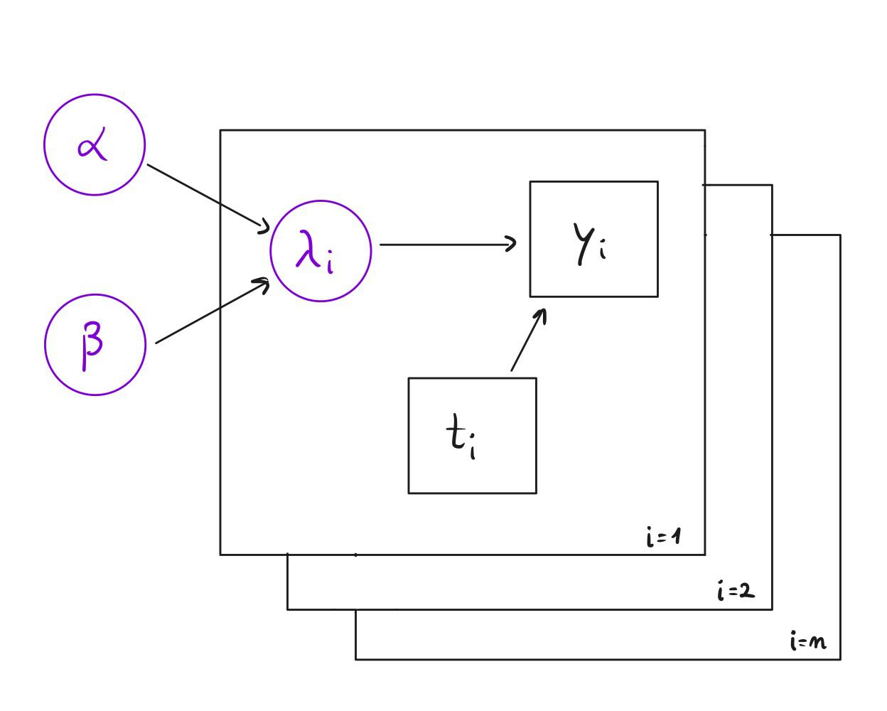

<style>
:root {
  --example-color: #2e7d32; /* Define your variable here (e.g., a forest green) */
}

.example-block {
  color: var(--example-color);
  border-left: 4px solid var(--example-color);
  padding-left: 15px;
  margin: 20px 0;
  font-style: italic;
}
</style>

```{r setup, include=FALSE}
knitr::opts_chunk$set(echo = TRUE)
```

## Hierarchical Bayesian Models
Hierarchical Bayesian Models, also known as Multilevel models, are Bayesian statistical models designed to handle structured, grouped, or nested data by modeling parameters themselves as random variables drawn from higher-level distributions.

They are extremely useful when data comes from multiple related groups and you want partial pooling rather than treating groups as completely independent or completely identical.

#### Comparison with classical statistics
In classical statistics, the parameters are estimated directly and each group might be modeled separately (no pooling) or all together (complete pooling).
In Hierarchical Bayesian Modeling instead, parameters themselves are random variables, group-level parameters are drawn from a shared population distribution and that population has its own parameters.

::: {.example-block}
#### Example (Universities)

Suppose to measure exam scores across multiple universities.

You could:

- Fit one global mean (complete pooling)
- Fit one mean per university (no pooling)

But reality is in between since universities differ but are not completely unrelated.

Hierarchical models allows partial pooling: estimates are "shrunk" toward the global mean.
The shrinkage is automatic in Bayesian inference.

:::

::: {.example-block}

#### Example (Power Plants)


- $i=1,2,\dots,n :=$ Number of power plants
- $y_i:=$ Number of failures of plant $i$
- $t_i :=$ How long plant $i$ has been operating

We want to estimate:

- $\lambda_i:=$ Failure rate of plant $i$

Units of $\lambda_i:=$ failures per unit time.

**Likelihood level (data model)**

The number of failures in time $t_i$, with a rate of failure of $\lambda_i$ is Poisson distributed with parameter $\mathbb E[y_i \vert \lambda_i] = \lambda_it_i$

$$
y_i \vert \lambda_i \stackrel{iid}{\sim} Poisson(\lambda_i t_i)
$$
This means that $\frac{y_i}{t_i}$ is the empirical rate estimate.

If we stopped here, we'd estimate: $\hat\lambda_i = \frac{y_i}{t_i}$,
but that would be no pooling.

Suppose that one plant ran only 3 months and it had 2 failures. Then $\hat \lambda_i = \frac 2{3/12} = 8$ => huge rate, but based on very little data. Hierarchical modeling prevents overreacting to small samples.


**Hierarchical Prior Level**

Instead of fixing each $\lambda_i$, we assume:

$$
\lambda_i\vert \alpha, \beta \stackrel{iid}{\sim} \Gamma(\alpha,\beta)
$$

This means that:

- Plants are different
- Their rates come from a common population distribution

Gamma distribution parameters, using a shape-rate parametrization:

$$
\mathbb E[\lambda_i] = \frac \alpha \beta\\
\mathrm{Var}(\lambda_i) = \frac \alpha {\beta^2}
$$

Interpretation: 

- $\frac \alpha\beta :=$ average failure rate across plants
- Variance controls heterogeneity

**Hyperprior Level**

Now we don't fix $\alpha, \beta$. We model them as random:

$$
\alpha \sim \exp(1.0) \\
\beta \sim \Gamma(0.1, 1.0)
$$

This makes the model **fully Bayesian**.

:::

### Directed Acyclic Graphs (DAGs)

A Directed Acyclic Graph (DAG) is a set of nodes, connected by directed arrows with no directed cycles.
In Bayesian modeling, they represent conditional dependence structure. 

- each node is a random variable
- each arrow is a direct probabilistic influence: $A\to B$ means
$$
B|A \sim f(B|A)
$$

They encode how the joint distribution factorizes.

#### Factorization rule

$$
f(x_1,\dots,x_n) = \prod_i f(x_i|\mathrm{parents}(x_i))
$$

::: {.example-block}

#### Example (Power Plants)
<center>
{width=50%}
</center>

For the factorization rule:


\begin{align}
f(\alpha,\beta, \lambda_{1:n}, y_{1:n})
&= f(\alpha) f(\beta)
   \prod_{i=1}^n f(\lambda_i \mid \alpha,\beta)
   \prod_{i=1}^n f(y_i \mid \lambda_i)
\\[6pt]
&= \underbrace{\alpha e^{-\alpha}}_{\text{Exp}(1)}
   \;
   \underbrace{\beta^{0.1-1} e^{-\beta}}_{\Gamma(0.1,1)}

   \prod_{i=1}^n
   \frac{\beta^\alpha}{\Gamma(\alpha)}
   \lambda_i^{\alpha-1}
   e^{-\beta \lambda_i}


   \prod_{i=1}^n
   \frac{(\lambda_i t_i)^{y_i} e^{-\lambda_i t_i}}{y_i!}
\end{align}

Posterior proportional to the joint:
$$
f(\alpha, \beta, \lambda_1,\dots, \lambda_n | y_1,\dots, y_n) \propto f(\alpha,\beta, \lambda_{1:n}, y_{1:n}) = e^{-\alpha}\beta^{0.1-1} e^{-\beta}\prod_{i=1}^n
   \frac{\beta^\alpha}{\Gamma(\alpha)} \lambda_i^{\alpha-1} e^{-\beta \lambda_i}   \prod_{i=1}^n \frac{(\lambda_i t_i)^{y_i} e^{-\lambda_i t_i}}{y_i!}
$$
How to sample from this?

- Markov Chain Monte Carlo

:::

## Markov Chain Monte Carlo
It is a method for generating samples from an high-dimensional probabiliy mass or density function $\pi(\mathbf x)$.

The core idea is to construct and simulate a Markov Chain $\{X_i\}_{i=0}^{\infty}$ having $\pi(\mathbf x)$ as its stationary distribution.

#### Ergodic Theorem for Markov Chains

If a chain is:

- Irreducible
- Aperiodic
- Positive recurrent

Then:
$$
X_t \overset{d}{\longrightarrow} \pi
$$
and
$$
\frac 1T \sum_{t=1}^{T} f(X_t) \to \mathbb E_{\pi}[f(X)]
$$

- $T:=$ number of iterations (length of the chain)
- $X_t:=$ state of the Markov Chain at time $t$

Each state $X_t$ is a specific value (or vector of values) of the parameters we are sampling. If the target distribution is $\pi(\mathbf x)$ with $\mathbf x\in \mathbb R^d$, then $X_t\in \mathbb R^d$.

::: {.example-block}

#### Example (Power Plants)

Consider the Power Plant model: $\pi(\alpha, \beta, \lambda_1,\dots, \lambda_n | y_1,\dots, y_n)$

The state of the chain is a tuple:
$$
X_t = (\alpha^{(t)}, \beta^{(t)}, \lambda_1^{(t)}, \dots, \lambda_n^{(t)})
$$
:::

Each time the chain moves, it updates all or some of these variables, depending on the algorithm:

- Gibbs sampling
- Metropolis-Hastings
- Slice sampling
- HMC
- etc.


#### Time reversaibility / detailed balance equation assumption
Backward transition probabilities:
$$
\mathbb P(X_i=x | X_{i+1} = y) = \frac{\mathbb P(X_{i+1} = y | X_i = x) \mathbb P(X_i=x)}{\mathbb P(X_{i+1} = y)} \overset{i\to +\infty}{\longrightarrow} \frac{p(y|x)\pi(x)}{\pi(y)} = p^*(x|y)
$$

- $p^*(x|y)$ is also called the time-reversed transition kernel. It tells, for an observed chain at state $y$, what is the probability that it was at $x$ one step earlier.

If $p(x|y) = p^*(x|y) \quad \forall x,y \implies$ the Markov Chain is time reversible

Time reversibility implies the **detailed balance equation**: $\pi(x)p(y|x)=\pi(y)p(x|y)$ 


- The Markov Chain flow from $x$ to $y$ equals the flow from $y$ to $x$.
- The Markov Chain looks statistically identical when run forward or backward in time.
- Detailed balance implies that $\pi$ is a stationary distribution.


### Metropolis-Hastings Algorithm (discrete space version)

Metropolis-Hastings builds a Markov Chain with transition probabilities $p(y|x)$, so that the target distribution $\pi(x)$ becomes stationary.

The algorithm works in two stages:

1. Propose a candidate $y\sim Q(y|x)$
2. Accept or reject it with probability $\alpha(y|x)$

So $p(y|x) = Q(y|x) \alpha(y|x) \quad \text{for } y\neq x$ is the probability of proposing $y$ AND accepting it.

We stay at $x$ if:

- We propose something
- And reject it

So the total probability of leaving $x$ is:
$$
\sum_{y\neq x} Q(y|x) \alpha(y|x)
$$
Therefore, the probability of not leaving (i.e. staying at $x$) is:
$$
p(y|x) = 1-\sum_{y\neq x} Q(y|x) \alpha(y|x)
$$

Putting everything together, the forward transition probabilities are given by:
$$
p(y|x) = \begin{cases}
Q(y|x) \alpha(y|x) \quad & \text{for } y\neq x \\
1-\sum_{y\neq x} Q(y|x) \alpha(y|x) \quad & \text{for } y=x
\end{cases}
$$

- $Q(y|x):=$ proposal conditional probability mass function
- $0\leq \alpha(y|x) \leq 1$ is the probability of accepting the transition from $x$ to $y$


#### Choosing $\alpha (y|x)$

$$
\alpha(y|x) = \min \Big( 1, \frac{\pi (y) Q(x|y)}{\pi(x) Q(y|x)} \Big )
$$

This guarantees that the detailed balance equation holds. 

#### Choosing $Q(y|x)$

**Minimal requirements: **

1. Support condition: $Q(y|x)>0 \quad \text{whenever } \pi(y) >0$
 
2. Irreducibility: must be able to reach any state (possibly in multiple steps)

A good proposal should account for:

- High acceptance rate
- Large moves
- Fast exploration (low autocorrelation)

**Trade-offs**:

- Large moves $\implies$ low acceptance
- Small moves $\implies$ high acceptance but slow mixing

#### Random walk proposal

Random walk proposal, e.g. $Q(y|x) = \mathcal N(x_{i-1},\sigma^2)$

$$
\alpha = \min\Big (1,\frac{\pi(y)}{\pi(x)}\Big)
$$

- $\sigma$ large $\implies$ large steps $\implies$ low acceptance
- $\sigma$ small $\implies$ small steps $\implies$ high acceptance but slow mixing

#### Special cases

- Metropolis Algorithm (1953): $Q(y|x) = Q(x|y)$
- Independence sampler (Tierney, 1994): $Q(y|x) = Q(y)$. Suitable if we can find a $Q(y) \simeq \pi(y)$
- Gibbs sampling

### Independence sampler

In a Metropolis-Hastings independence sampler, the proposal distribution $Q(y|x)$ does not depend on the current state $x$:

$$
Q(y|x) = Q(y)
$$

- This is called "independence" because the proposal is independent of the current state.
- The acceptance probability is:
$$
\alpha(x,y) = \min\Big (1, \frac{\pi(y)Q(x)}{\pi(x)Q(y)}\Big)
$$
- If we could choose $Q(y)=\pi(y)$ (the target distribution), then every proposal is accepted, because $\alpha(x,y) \simeq 1$. Of course this is not feasible in reality, so we have to approximate it.

::: {.example-block}

#### Example (Rao, 1973)

$$
(y_1,y_2, y_3, y_4) \sim \mathrm{Multinom}\Big(n,\frac 12 +\frac \theta 4, \frac{1-\theta}4,\frac{1-\theta}4,\frac \theta 4\Big)
$$
$\pi(\theta) = 1$ for $0<\theta<1$
$$
L(\theta |y) \propto \Big (\frac 12+\frac\theta4\Big)^{y_1}\Big(\frac{1-\theta}{4}\Big)^{y_2}\Big(\frac{1-\theta}{4}\Big)^{y_3}\Big(\frac{\theta}{4}\Big)^{y_4}
$$
Posterior:
$$
\pi(\theta |y) \propto L(\theta | y)\pi(\theta)
$$

**Choosing a good proposal $Q(\theta)$**

1. Compute MLE: $\hat \theta= \arg\max_{\theta}L(\theta|y)$ 
2. Compute observed Fisher information: $H(\hat \theta) = -\frac{\partial^2 \log L}{\partial \theta} \Big\vert_{\theta = \hat \theta}$
3. Approximate posterior variance: $\widehat{SE(\hat \theta)}^2=H(\hat \theta)^{-1}$

A good choice of $Q(\theta)$ might be:
$$
\theta^*\sim Q(\theta) = \mathcal N\Big(\hat \theta, \widehat{SE(\hat \theta)}^2\Big)
$$
:::

### Iterative conditioning in MCMC

Apply Metropolis-Hastings randomly or cyclically to components $x_j$ of $\mathbf x$, conditioning on the remaining components

$$
\mathbf x_{-j} = (x_1,x_2, \dots, x_{j-1}, x_{j+1}, \dots , x_p)
$$
For the detailed balance equation, $Q(\mathbf y | \mathbf x)$ is a mixture: the overall proposal distribution is formed by combining several component-wise proposal distributions, each corresponding to updating a different coordinate $j$.

**Component-wise proposals:**

$$
Q_j(y_j|x_j,-\mathbf{x_j}), \quad j=1,2,\dots,p
$$


with acceptance probability:

$$
\begin{align}
\alpha (\mathbf y_j \mid x_j,\mathbf x_{-j})
&= \min \Big( 1, \frac{\pi (y) Q(x\mid y)}{\pi(x) Q(y\mid x)} \Big ) \\
&= \min \Big (1, \frac{\pi (y_j \mid \mathbf y_{-j})\pi(\mathbf y_{-j}) Q_j(x_j|y_j,\mathbf y_{-j})}{\pi(x_j|\mathbf x_{-j}) \pi(\mathbf x_{-j}) Q_j (y_j|x_j,\mathbf x_{-j})} \Big)
\end{align}
$$

- $\pi(\mathbf y_{-j})= \pi (\mathbf x_{-j})$ (only the $j$-th component changes $\implies \mathbf y_{-j} = \mathbf x_{-j}$)
- Since $\pi(y_j|\mathbf y_{-j}) \propto \pi(\mathbf y)$, only factors containing $y_j$ needs to be evaluated.$\implies$ it makes high dimensional MCMC more efficient.

### Gibbs Sampling

It's Iterative conditioning MCMC with:

$$
Q_j(y_j|x_j,\mathbf x_{-j}) = \pi (y_j | \mathbf x_{-j})
$$

It requires that:

1. For all components, the conditional distributions are known and easy to sample.
2. The joint distribution is compatible with component-wise updates

Notice also that high correlated component may lead to slow convergence.

::: {.example-block}

#### Example (Power Plants)

\begin{align}
f(\alpha, \beta, \lambda_1,\dots, \lambda_n | y_1,\dots, y_n) & \propto  f(\alpha,\beta, \pmb \lambda_{1:n}, \pmb y_{1:n}) = \\ 

& = e^{-\alpha}\beta^{0.1-1} e^{-\beta}\prod_{i=1}^n
   \frac{\beta^\alpha}{\Gamma(\alpha)} \lambda_i^{\alpha-1} e^{-\beta \lambda_i}   \prod_{i=1}^n \frac{(\lambda_i t_i)^{y_i} e^{-\lambda_i t_i}}{y_i!}
\end{align}

**Parameters:**

- $\beta$

\begin{align}
\pi(\beta | \alpha, \pmb\lambda_{1:n},\pmb y_{1:n}) & = \beta^{-0.9} e^{-\beta} \prod_{i=1}^n \beta^\alpha e^{-\beta \lambda_i} = \\

& = \beta^{(\alpha n - 0.9)} e^{-\beta(1+ \sum_{i=1}^n \lambda_i)}
\\
& \sim \Gamma \Big(\alpha n+1,\ 1+ \sum_{i=1}^n \lambda_i\Big)
\end{align}

- $\lambda_i \quad i=1,2,\dots, n$

\begin{align}
\pi(\lambda_i | \alpha, \beta, \pmb \lambda_{-i}, \pmb y_{1:n}) & \propto 
\lambda_i^{\alpha-1+y_i}e^{-(\beta + t_i)\lambda_i} \\
& \sim \Gamma(\alpha+y_i, \beta+t_i)
\end{align}

- $\alpha$

$$
\pi (\alpha | \beta, \pmb \lambda_{1:n} , \pmb y_{1:n}) \propto e^{(-1+n\ln (\beta)+\sum_{i=1}^n\ln(\lambda_i))\alpha}\ \Gamma(\alpha)^{-n}
$$
We can't simulate from this. Instead, we can use Metropolis random walk proposal, e.g.

$$
\alpha ' = \alpha, \beta, \pmb \lambda_{1:n}, \pmb y_{1:n} \sim \mathcal N \begin{pmatrix} \alpha, \sigma_\alpha ^2\end{pmatrix}
$$
Since the proposal is symmetric, meaning $Q(\alpha'|\alpha)= Q(\alpha|\alpha')$ because it's a Normal distribution centered at the current state, the proposal densities cancel out. Te acceptance probability is:

$$
\alpha_{acc}(\alpha, \alpha') = \min \begin{pmatrix}1, \frac{\pi(\alpha'|\beta, \pmb \lambda_{1:n}, \pmb y_{1:n})}{\pi(\alpha|\beta, \pmb \lambda_{1:n}, \pmb y_{1:n})}\end{pmatrix}
$$

Using the conditional posterior derived for $\alpha$:$$\pi (\alpha | \dots) \propto \exp\left[ \left(-1 + n\ln\beta + \sum_{i=1}^n \ln\lambda_i \right)\alpha \right] \Gamma(\alpha)^{-n}$$

The ratio $\frac{\pi(\alpha')}{\pi(\alpha)}$ becomes:

$$\frac{\exp\left[ \left(-1 + n\ln\beta + \sum \ln\lambda_i \right)\alpha' \right] \Gamma(\alpha')^{-n}}{\exp\left[ \left(-1 + n\ln\beta + \sum \ln\lambda_i \right)\alpha \right] \Gamma(\alpha)^{-n}}$$
**Log-Acceptance Rate**

In practice, we always compute this on the log scale to maintain numerical stability (especially with the $\Gamma$ functions and the large products):$$\log R = \left(-1 + n\ln\beta + \sum_{i=1}^n \ln\lambda_i \right)(\alpha' - \alpha) + n \left[ \ln\Gamma(\alpha) - \ln\Gamma(\alpha') \right]$$

:::

::: {.example-block}

#### Example (Simple Linear Regression)


:::
