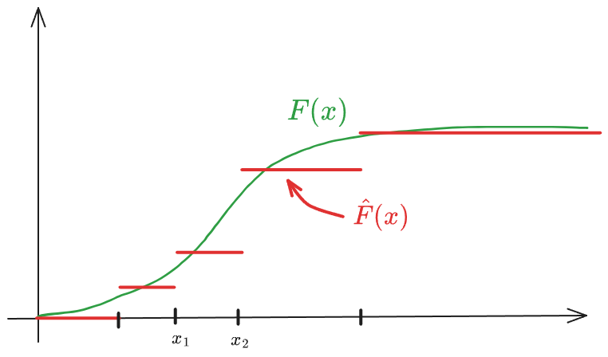

<style>
:root {
  --example-color: #2e7d32; /* Define your variable here (e.g., a forest green) */
}

.example-block {
  color: var(--example-color);
  border-left: 4px solid var(--example-color);
  padding-left: 15px;
  margin: 20px 0;
  font-style: italic;
}
</style>

```{r setup, include=FALSE}
knitr::opts_chunk$set(echo = TRUE)
```

# Bootstrapping

Bootstrapping in statistics is a resampling technique used to estimate the distribution of a statistic (like a mean, median, or regression coefficient) by repeatedly sampling from the data we already have.

**Core Idea**:

Instead of collecting new data (which can be expensive or impossible), you:

1. Take your original dataset of size n
2. Randomly sample n observations with **replacement** (this is key)
   - *Replacement* means that the same observation can appear multiple times and some observations may not appear at all.
3. Compute the statistic of interest (e.g., the mean)
4. Repeat this many times (often thousands)
5. Use the resulting distribution of those computed statistics to draw conclusions

:::{.callout-tip}
### Simple example

Suppose you have 10 observations and want to estimate the mean’s uncertainty:

- You resample those 10 values (with replacement) 1,000 times
- Compute the mean for each resample
- Now you have 1,000 “bootstrapped means”
- The spread of these gives you an estimate of variability and confidence intervals
:::

## Non-parametric bootstrapping

is the standard form of bootstrapping where you don’t assume any specific distribution for your data (like normal, exponential, etc.).

:::{.callout-tip}
Imagine your dataset is:

[2, 4, 5, 7, 9]

Non-parametric bootstrapping treats this as a “mini population.”
A resample might look like:

[4, 4, 7, 2, 9]

No assumptions—just reshuffling with repetition.
:::

**Simplest case**: iid samples $X_1, \dots, X_n \sim F$ where $F$ is an unknown cdf.
Find estimator of:
$$
\theta = t(F)
$$
Il Principio di Plug-in è un metodo per stimare parametri della popolazione senza assumere che i dati seguano una distribuzione specifica (come la Normale). L'idea è trattare il campione raccolto come se fosse l'intera popolazione.

e.g. 
$$
\theta = \mathbb E(X) = \int_{-\infty}^{\infty} x \ \mathrm d F(x) = \begin{cases}\int_{-\infty}^\infty x f(x) \mathrm d x \quad & \text{if} X \text{ is continuous} \\ \sum_x x f(x) \quad & \text{if}\ X\ \text{is discrete}\end{cases}
$$

or

$$
\theta = \mathrm{Var}(X)=\int (x-\mathbb E(X))^2 \ \mathrm d F
$$


- $F$ can be estimated non-parametrically by the estimator
$$
\hat F (\pmb x) = \frac 1n \sum_{i=1}^n I(\pmb x_i \leq \pmb x)
$$
the empirical cdf.
La funzione di distribuzione empirica ($\hat{F}$) è uno stimatore non parametrico che 'salta' di $1/n$ in corrispondenza di ogni dato osservato. È fondamentale perché, per il teorema di Glivenko-Cantelli, sappiamo che all'aumentare di $n$, $\hat{F}$ converge alla distribuzione vera $F$.



- The corresponding (plug-in) estimator of $\theta$ is
$$
\hat \theta = t(\hat F)$$

Thus, if $\theta = \mathbb E(X)=\int x \mathrm dF$,
$$
\hat \theta = \int_{-\infty}^\infty x \ \mathrm d \hat F = \sum_x x \hat f(x) = \sum_{i=1}^n x_i \frac 1n = \bar x = \mathbb E_{\hat F}(X)
$$
L'integrale rispetto a $d\hat{F}$ si trasforma in una sommatoria perché la distribuzione empirica è discreta e assegna peso $1/n$ a ogni punto.

and if $\theta = \mathrm Var(X) = \int (X-\mathbb E(X))^2 \ \mathrm dF$,

\begin{align*}
\hat \theta = \widehat{\mathrm{Var}(X)} = \sum_x (x-\mathbb E (X))\hat f(x) = \\
= \sum_{i=1}^n(x_i-\bar x)^2 \frac 1n = \frac 1n \sum_{i=1}^n(x_i-\bar x)^2= \mathrm{Var}_{\hat F}(X)
\end{align*}

Nota: Lo stimatore plug-in della varianza usa il divisore $n$. Sebbene sia leggermente distorto (sottostima la varianza reale), è la conseguenza naturale dell'applicazione del principio di sostituzione sulla popolazione campionaria.

If $\theta = \mathrm{SD}(X)$,
$$
\hat \theta = \widehat{\mathrm{SD}(X)} = SD_{\hat F} (X)
$$

If $\theta=Skew(X)=\mathbf E((\frac{X-\mu}{\sigma})^3)$, the plug in estimator of $\theta$ is:
$$
\hat \theta = Skew_{\hat F}(X)
$$

Il vero vantaggio del metodo plug-in emerge con parametri come lo Skewness o la Mediana, dove il calcolo analitico della distribuzione dello stimatore sarebbe molto difficile. Sostituendo $F$ con $\hat{F}$, otteniamo una stima immediata basata sui dati.

What is the sampling distribution of these plug-in estimators if we replace $F$ by $\hat F$?

### Approximate method

1. **Generate $B$ bootstrap samples**
$$
X^1, X^2 , \dots , X^B \quad \text{where} \ X^b = (x_1^b, x_2^b, \dots, x_n^b)
$$
and 
$$
x_i^b\overset{iid}{\sim} \hat F\ \  \text{ for }\ \ i=1,2,\dots,n, \quad b=1,2,\dots,B
$$
Estrarre un campione da $\hat{F}$ equivale a fare un campionamento con reinserimento (sampling with replacement) dal set di dati originale $\{x_1, \dots, x_n\}$. Ogni campione bootstrap ha la stessa numerosità $n$ del campione originale.
2. **Compute corresponding bootstrap replicates of plug-in estimator $\hat \theta$ of $\theta$**,
$$
\hat \theta^b = t(\hat F^b)
$$
Per ogni nuovo set di dati 'artificiale' $X^b$, calcoliamo la statistica di interesse (es. media, mediana, varianza). Queste $\hat{\theta}^b$ formano la distribuzione bootstrap, che usiamo come approssimazione della distribuzione campionaria reale dello stimatore.
3. **Estimate** e.g. $\mathbb E_{\hat F}(\hat \theta)$ and $\mathrm{SD}_{\hat F}(\hat \theta)$ or, in general $\mathbb E(h(\hat \theta))$, by Monte-Carlo intergration, i.e.
$$
\widehat{\mathbb E(\hat \theta)} = \frac 1B \sum_{b=1}^B \hat \theta ^b
$$
and
$$
\widehat{\mathrm{SD}(\hat \theta)} = \sqrt{\frac 1{B-1} \sum_{b=1}^B \Big(\hat \theta ^b-\widehat{\mathbb E(\hat \theta)}\Big)^2}
$$
Poiché calcolare esattamente tutte le possibili combinazioni di $\hat{F}$ sarebbe computazionalmente impossibile (sono $n^n$), usiamo l'integrazione Monte Carlo. Più grande è $B$ (solitamente $B \geq 1000$), più la nostra stima della variabilità di $\hat{\theta}$ sarà precisa.
La deviazione standard delle repliche bootstrap è la stima dell'errore standard dello stimatore originale $\hat{\theta}$.

### Exact method
Mentre il metodo approssimato usa Monte Carlo per estrarre $B$ campioni, il Metodo Esatto calcola il valore atteso del plug-in estimator pesando ogni possibile combinazione campionaria per la sua probabilità teorica. Questo elimina l'errore di simulazione, lasciando solo l'errore statistico dovuto a $n$ piccolo.

It is applicable for small $n$.
If the original sample $x_1,x_2,\dots ,x_n$ consists of distinct values the number of unordered outcomes.
($(x_4,x_4,x_1,x_2)$ the same as $(x_1,x_2,x_4,x_4)$) is
$$
\binom{2n-1}{n-1} \approx \Big(n\pi \Big)^{-\frac 12}2^{2n-1}\ \overset{n=10}= \ 92378
$$
and the probability of observing $m_1,m_2, \dots, m_n$ of each value $x_1, x_2, \dots, x_n$ is
$$
\frac{n!}{m_1!m_2!\dots m_n!} \cdot \underbrace{\Big(\frac 1n\Big)^{m_1}\Big(\frac 1n\Big)^{m_2}\cdot \dots \cdot \Big(\frac 1n\Big)^{m_n}}_{n^{-n}}
$$
since $m_1,\dots ,m_n \sim \mathrm{multinorm}\Big(n,\Big(\frac 1n, \frac 1n, \dots , \frac 1n\Big)\Big)$

infatti, ogni campione bootstrap ha una probabilità specifica di verificarsi, dettata dalla distribuzione Multinomiale. Poiché la ECDF assegna probabilità $1/n$ a ogni $x_i$, la probabilità di osservare un vettore di frequenze $\pmb m$ (dove $\sum m_i = n$) segue la logica del 'lancio del dado' a $n$ facce ripetuto $n$ volte.

**Riassumendo:**

- Ideal (exact) Bootstrap: Teoricamente perfetto, ma computazionalmente impossibile per $n > 15$ circa.
- Monte Carlo Bootstrap: L'approssimazione pratica che usiamo tutti i giorni, dove l'errore diminuisce all'aumentare di $B$.

## Parametric bootstrapping

A differenza del bootstrap non parametrico, qui assumiamo di conoscere il modello (es. i dati seguono una Normale o una Poisson). L'unica cosa che non conosciamo è il valore esatto dei parametri $\pmb \theta$ di quella distribuzione.

Suppose original data
$$
\pmb x = (x_1,x_2, \dots, x_n) \sim F(\pmb x; \pmb \theta)
$$
where $F$ is known and $\pmb \theta$ is unknown.

Estimate $\pmb \theta$ by $\hat {\pmb \theta}$ (by given method, e.g. ML) and $F(\pmb x; \pmb \theta)$ by $F(\pmb x; \hat{\pmb \theta})$

Il primo passo consiste nell'usare i dati reali per trovare la 'migliore' distribuzione teorica che li descrive. Di solito si usa la Maximum Likelihood (ML).

**Algorithm:**

1. **Simulate $\pmb x^1, \pmb x^2, \dots, \pmb x^B \overset{iid}{\sim} F(\pmb x;\hat \theta)$**<br>
Qui non campioniamo più dai dati originali (non facciamo reinserimento). Invece, usiamo il computer per generare nuovi numeri casuali direttamente dalla distribuzione teorica $F(\pmb x; \hat{\pmb \theta})$.
2. **Compute corresponding bootstrap replicates of $\hat{\pmb \theta},\ \hat{\pmb \theta}^b, \ b=1,2,\dots, B$ (by same given method)** <br>
Per ogni campione simulato, ricalcoliamo il parametro con lo stesso metodo (es. ML). Questo ci dice quanto sarebbe variata la nostra stima se la popolazione fosse esattamente quella identificata da $\hat{\pmb \theta}$.
3. **Estimate $\mathbb E(h(\hat \theta))$ by Monte-Carlo integration**<br>

| Vantaggio | Svantaggio |
| --- | --- |
| Se l'assunzione sul modello $F$ è corretta, il bootstrap parametrico è generalmente più preciso di quello non parametrico (ha un errore standard minore), perché sfrutta l'informazione aggiuntiva data dalla forma della distribuzione. | Se però il modello scelto è sbagliato (es. i dati non sono Normali ma noi assumiamo che lo siano), i risultati del bootstrap parametrico saranno distorti e inaffidabili. |

### Estimating and correcting for bias

Having estimated $\mathbb E(\hat \theta)$ by $\widehat{\mathbb E(\hat \theta)} = \frac 1B \sum_{b=1}^B \hat \theta^b$, an estimator of $\widehat{\mathrm{Bias}(\hat \theta)}=\widehat{\mathbb E(\hat \theta)}-\hat \theta$
is:
$$
\widehat{\mathrm{Bias}(\hat \theta)} = \widehat{\mathbb E(\hat \theta)} - \hat \theta
$$

Subtracting the estimated bias from $\hat \theta$, we obtain a bias-corrected estimator:

$$
\hat \theta_c = \hat \theta - \widehat{\mathrm{Bias}(\hat \theta)}
$$
  
Typically has less but non-zero bias and sometimes higher variance.

:::{.callout-tip}
### Ex. August 2024, Problem 4

$X_1,\dots,X_n \overset{\mathrm{iid}}{\sim} F$, with $F(x)=1-e^{-\lambda x}$ (exponential distribution)

- The MLE of $\lambda$ is $\hat \lambda = \frac n{\sum_{i=1}^n X_i}$
- Observed data gives $\hat \lambda= 2.0$

Let $\pmb x^b$ and $\hat \lambda^b$, $b = 1,2,\dots, B$ denote the parametric bootstrap samples from $F(\hat \lambda)$, and suppose $\frac 1B \sum \hat \lambda ^b = 2.24$

1. An estimate of $\mathbb E(\hat \lambda)$ is then $\widehat{\mathbb E(\hat \lambda)} = \frac 1B \sum \hat \lambda^b = 2.24$ and an estimate of $\mathrm Bias (\hat \lambda) = \mathbb E(\hat \lambda)-\lambda$ is
$$
\widehat{\mathrm{Bias}(\hat \lambda)} = \widehat{\mathbb E(\hat \lambda)} -\hat \lambda = 2.24 - 2 = 0.24
$$
A bias corrected estimate of $\lambda$ is then:
$$
\hat \lambda_c = \hat \lambda - \widehat{\mathrm{Bias}(\hat \lambda)} = \hat \lambda - \Big ( \frac 1B \sum_{b=1}^B \hat \lambda ^b-\hat \lambda\Big) = 2\hat \lambda - \frac 1B \sum_{b=1}^B \hat \lambda ^b = 2-0.24 = 1.76 
$$

2. In this particular example, we know analytically that
$$
\mathbb E(\hat \lambda) = \frac n{n-1}\lambda \overset{n=10}= \frac {10}9 \lambda = 1.11 \lambda
$$
This implies that
$$
\mathbb E(\hat \lambda^b | \hat \lambda) = \frac n{n-1}\hat \lambda
$$
Thus,
\begin{align*}
\mathbb E(\hat \lambda_c | \hat \lambda) = \mathbb E \Big ( 2\hat \lambda - \frac 1B \sum \hat \lambda ^b \vert \hat \lambda \Big ) = 
\end{align*}

:::


## Bootstrap confidence intervals

### Percentile method

1. Generate $X_1, X_2, \dots , X_B \overset{\text{iid}}{\sim} \hat F$
2. Compute $\hat \theta_1, \hat \theta_2, \dots, \hat \theta_B$
3. Compute empirical $\alpha/2$ and $1-\alpha/2$ quantiles of $\hat \theta^{(b)}, \hat \theta_{\alpha/2}^{(b)}, \ \hat \theta_{1-\alpha/2}^{(b)}$
**Justification**: valid if a strictly increasing transformation $\phi(\theta)$ exists, such that $\phi(\hat \theta)-\phi(\theta)$ has cdf $H(z)=1-H(-z)$.
Then:

$$
\mathbb P\Big(h_{\alpha/2} \leq \phi (\hat \theta) -\phi(\theta) \leq h_{1-\alpha/2}\Big) = 1-\alpha
$$ {#eq-ci}

where $h_\alpha= H ^{-1}(\alpha)$.

Given an existing implicit $\phi$, bootstrap replicates of $\phi(\hat \theta)-\phi(\theta)$ are given by $\phi(\hat \theta^{(b)})-\phi(\hat \theta)$
satisfying
$$
\mathbb P\Big(h_{\alpha/2} \leq \phi(\hat \theta^{(b)})-\phi(\hat \theta)\leq h_{1-\alpha/2}\Big) \simeq 1-\alpha
$$
and so:
$$
\mathbb P\Big (\underbrace{\phi^{-1}(h_{\alpha/2} + \phi (\hat \theta)) }_{\hat \theta^{(b)}_{\alpha/2}} \leq \hat \theta^{(b)} \leq \underbrace{\phi^{-1}(h_{1-\alpha/2} +\phi(\hat \theta)}_{\hat \theta^{(b)}_{1-\alpha/2}} \Big) \simeq 1-\alpha
$$
The empirical quantiles $\hat \theta_{\alpha/2}^{(b)}$ and $\hat \theta^{(b)}_{1-\alpha/2}$ of $\hat \theta^{(b)}$ are explicitly known from bootstrap distribution of $\hat \theta^{(b)}$.

From @eq-ci we have:
$$
\mathbb P\Big ( -h_{\alpha/2} \geq \phi(\theta)-\phi(\hat \theta) \geq -h_{1-\alpha/2}\Big) = 1-\alpha
$$
Since $H(z) = 1-H(-z),\quad h_{\alpha/2} = -h_{1-\alpha/2}$ and so
$$
\mathbb P\Big ( h_{\alpha/2} \leq \phi(\theta)-\phi(\hat \theta) \leq h_{1-\alpha/2}\Big) = 1-\alpha
$$
and
$$
\boxed{
\mathbb P\Big (\underbrace{\phi^{-1}(\phi(\theta)-h_{\alpha/2})}_{\hat \theta_{\alpha/2}^*} \leq \theta \leq \underbrace{\phi^{-1} (\phi(\hat \theta)-h_{1-\alpha/2})}_{\hat \theta_{1-\alpha/2}^*} \Big) = 1-\alpha
}
$$
Thus, $\Big [\hat \theta_{\alpha/2}^*, \hat \theta^*_{1-\alpha/2}\Big]$ is a confidence interval for $\theta$. Note that $\phi$ and $h_{\alpha/2}, \ h_{1-\alpha/2}$ do not need to be known explicitly!

:::{.callout-tip}
### Example of failure of percentile method

Suppose $X_1,\dots, X_n \overset{iid}{\sim}\mathcal N(\mu,\sigma^2)$
It follows that parametric bootstrap replicates of $\frac{\hat \sigma^2(n-1)}{\sigma^2}$, i.e. $\frac{\hat \sigma^{2b}(n-1)}{\hat \sigma^2}\sim \chi^2_{n-1}$ and bootstrap replicates of $\hat \sigma^2$, i.e. $\hat \sigma^{2b} \sim \frac{\hat \sigma^2}{n-1}\chi^2_{n-1}$.

So the percentil-method interval is (un to Monte-Carlo error):
$$
\Bigg (\frac{\hat \sigma^2 \chi^2_{\alpha/2,n-1}}{n-1},\frac{\hat \sigma^2\chi^2_{1-\alpha/2,n-1}}{n-1}\Bigg)
$$
But the classical exact interval is:
$$
\Bigg(\frac{\hat \sigma^2(n-1)}{\chi^2_{1-\alpha/2,n-1}}, \frac{\hat \sigma^2 (n-1)}{\chi^2_{\alpha/2, n-1}}\Bigg)
$$

- **Why it fails**: The $\chi^2$ distribution is heavily skewed (especially for small $n$). The "Percentile Method" assumes there is a transformation $\phi$ that makes the distribution of $\hat{\sigma}^2$ symmetric. While a log-transform helps, the basic percentile method applied directly to $\hat{\sigma}^2$ ignores the fact that the sampling distribution of the variance is not transformation-respecting in a way that centers it correctly.
- **The Result**: The percentile interval ends up being "flipped" compared to the pivotal (exact) interval. Specifically, the percentile method uses the quantiles of the bootstrap distribution directly, whereas the exact method uses the reciprocals of the $\chi^2$ quantiles.
:::

| Method | Formula | Key Assumption |
| --- | --- | --- |
| Percentile | $[\hat \theta_{\alpha/2}^{(b)}, \hat \theta_{1-\alpha/2}^{(b)}]$ | Existance of a symmetry-transform $\phi$ |
| Basic (Pivotal) | $[2\hat \theta - \hat \theta^{(b)}_{1-\alpha/2}, 2\hat \theta -\hat \theta^{(b)}_{\alpha/2}]$ | $\hat \theta - \theta$ is the pivot |

## Bootstrapping regression

**Model:**
$$
y_i=\pmb x_i^\top \pmb\beta + \varepsilon_i
$$
where the errors $\varepsilon_i$ are iid zero mean constant variance $\sigma^2$ (homoscedasticity).

In matrix notation:
$$
\pmb y = X\pmb \beta +\pmb \varepsilon
$$

**Least square estimate** of $\pmb \beta$ is:
$$
\hat{\pmb \beta}= \arg\min_{\pmb \beta} \Vert \pmb y-X\pmb \beta \Vert _2^2 = (X^\top X)^{-1}X^\top \pmb y
$$
Residuals defined as:
$$
\hat{\varepsilon}_i = y_i-\pmb x_i^\top \hat{\pmb \beta}
$$

**Bootstrapping residuals:**

1. For each bootstrap iteration $b = 1, \dots, B$, generate $n$ bootstrap errors $\pmb\varepsilon_b^* = (\varepsilon_{1,b}^*, \dots, \varepsilon_{n,b}^*)$ by resampling with replacement from $\hat{\varepsilon}_1 , \dots, \hat{\varepsilon}_n$.
2. Loop: For each iteration $b$:

    - Compute the synthetic response: $y_{i,b}^* = \pmb x_i^\top \hat{\pmb\beta} + \varepsilon_{i,b}^*$
    - Compute the bootstrap replicate estimate: $\hat{\pmb\beta}_b^* = (X^\top X)^{-1}X^\top \pmb y_b^*$

:::{.callout-tip}
### Why residuals bootstrapping is more appropriate for experimental data
This residual bootstrap method is highly appropriate for experimental data where the design matrix $X$ is fixed by the experimenter. If $X$ is random (e.g., observational survey data), paired bootstrapping (resampling the entire tuple $(\pmb x_i, y_i)$ together) is usually preferred because it doesn't assume homoscedasticity.
:::

**Bootstrapping pairs:**

1. For each bootstrap iteration $b = 1, \dots, B$, generate a bootstrap sample of size $n$:
$$
(\pmb x_{1,b}^*, y_{1,b}^*), \dots, (\pmb x_{n,b}^*, y_{n,b}^*)
$$
by sampling the original data pairs $(\pmb x_i, y_i)$ with replacement.
2. Loop: For each iteration $b$:

    - Construct the bootstrap design matrix $X_b^*$ and response vector $\pmb y_b^*$ from the sampled pairs.
    - Compute the bootstrap replicate estimate:
    $$\hat{\pmb\beta}_b^* = (X_b^{*\top}X_b^*)^{-1}X_b^{*\top} \pmb y_b^*$$

:::{.callout-tip}
### Why pairs bootstrapping is more appropriate for observational data
Unlike the residual bootstrap, paired bootstrapping does not rely on the model being correctly specified, nor does it assume the errors have a constant variance (homoscedasticity). If your observational data has heteroscedasticity (where data volatility changes across different values of $X$), paired bootstrapping inherently preserves that relationship and gives you valid standard errors.
:::

## Accelerated Bias-corrected Percentile Method $BC_a$

Assume a strictly increasing monotonic transformation $\phi()$ and constants $a$ (acceleration) and $b$ (bias-correction) exist such that:
$$
U=\frac{\phi(\hat \theta)-\phi(\theta)}{1+a\phi(\theta)}+b\sim \mathcal N(0,1)
$${#eq-U1}

Assuming the bootstrap replicates $U^*$ follow the exact same distribution under the empirical distribution $\hat F$:
$$
U^* = \frac{\phi(\hat{\theta}^*)-\phi(\theta)}{1+a\phi(\theta)}+b\sim \mathcal N(0,1)
$${#eq-Ustar}
Thus, from @eq-Ustar,
$$
\begin{aligned}
\beta &= \mathbb P(U^*\leq z_\beta) \\
&= \mathbb P\Big(
\frac{\phi(\hat{\theta}^*)-\phi(\theta)}
     {1+a\phi(\theta)} + b
\leq z_\beta \Big) \\
&= \mathbb P\Big(
\hat{\theta}^* \leq
\underbrace{\phi^{-1}\big(
\phi(\hat \theta)
+(z_\beta-b)[1+a\phi(\hat \theta)]
\big)}_{=\hat{\theta}_\beta^* = \substack{\text{observable empirical}\\ \beta-\text{quantile of }\hat{\theta}^*}}
\Big)
\end{aligned}
$$ {#eq-probhattheta}

Similarly, from $(1)$, isolating $\theta$ rather than $\hat \theta$.
\begin{align*}
1-\alpha &= \mathbb P(U>z_\alpha) \\
&=\mathbb P\Big (\frac{\phi(\hat \theta)-\phi(\theta)}{1+a\phi(\theta)}+b>z\alpha \Big) \\
& =\mathbb P\Big(\phi(\hat \theta)-\phi(\theta) > (z_\alpha -b)(1+a\phi(\theta))\Big) \\
&= \mathbb P\Big(\phi(\hat \theta)+b-z_\alpha >[1\underbrace{-a(b-z_\alpha)}_{(z_\alpha-b)a}]\phi(\theta)\Big) \\
&= \mathbb P \Big (\theta < \phi^{-1} \Big ( \frac{\phi(\hat \theta)+b-z_{\alpha}}{1-a(b-z_\alpha)}\Big)\Big) \\
& = \mathbb P\Big ( \theta < \underbrace{\phi^{-1}\Big ( \phi(\hat \theta)+\frac{b-z_\alpha}{1-a(b-z_\alpha)} (1+a\phi(\hat \theta)) \Big)}_{(*)}\Big)
\end{align*}

$(*)$ is the upper limit of a $(1-\alpha)$ one sided confidence interval for $\theta$, equal to $\hat{\theta}_\beta^*$ for 
$$
\frac{b-z_\alpha}{1-a(b-z_\alpha)} = z_\beta -b
$$
Solving for $\beta$ yields the exact mapping for our interval endpoint:
$$
\beta = \Phi\Big ( b+\frac{b-z_\alpha}{1-a(b-z_\alpha)}\Big)
$$
A two-sided $(1-\alpha)$ confidence interval is given by $\Big ( \hat{\theta}_{\beta_1}^*, \hat{\theta}_{\beta_2}^*\Big)$, where you calculate $\beta_1$ using $z_{1-\alpha/2}$ and $\beta_2$ using $z_{\alpha/2}$.

### Estimating $a$ and $b$ (Shao & Tu, 1996)

Because $\phi()$ is an imaginary tool used only for the derivation, we calculate our tuning parameters non-parametrically directly from the data:

\begin{align*}
b &= \Phi^{-1}\Big (\overbrace{F_{\hat{\theta}^*}(\hat \theta)}^{\text{cdf of } \hat{\theta}^*}\Big) \approx \Phi^{-1}\left(\frac{1}{B}\sum_{b=1}^B \mathbb{I}(\hat{\theta}_b^* < \hat{\theta})\right) \\
a &= \frac{\frac{1}{6} \sum_{i=1}^n \psi_i^3}{\Big(\sum \psi_i^2 \Big)^{2/3}}
\end{align*}

Where we use the jackknife values:

- $\psi_i = \hat{\theta}_{()} - \hat{\theta}_{(-i)}$
- $\hat{\theta}_{(-i)}$ is the estimate calculated by omitting the $i$-th observation.
- $\hat{\theta}_{()} = \frac{1}{n} \sum_{i=1}^n \hat{\theta}_{(-i)}$ (the jackknife mean).

## Bootstrap $t$ confidence interval

Suppose an estimate $\hat V$ of the variance of $\hat \theta$ is "directly" available.

:::{.callout-tip}
### Example: regression, $\hat \theta = f(\hat \beta_0, \hat \beta_1) = \frac{\hat \beta_1}{\hat \beta_0}$

$$
\hat V = \widehat{\mathrm{Var} ( \hat \theta)} \approx \Big (\frac{\partial f}{\partial \beta_0}\Big)^2 \widehat{\mathrm{Var}(\hat \beta_1)} + 2 \Big (\frac{\partial f}{\partial \beta_0}\Big)\Big (\frac{\partial f}{\partial \beta_1}\Big)\widehat{\mathrm{Cov}(\beta_0,\beta_1)}+\Big (\frac{\partial f}{\partial \beta_1}\Big)^2 \widehat{\mathrm{Var}(\hat{\beta}_1)}
$$
Then:
$$
R=\frac{\hat \theta-\theta}{\sqrt{\hat V}}
$$
is approximately pivotal. The bootstrap replicates
$$
R^*=\frac{\hat{\theta}^*-\hat \theta}{\sqrt{\hat{V}^*}}
$$
should have approximately same distribution and observable quantiles $R_{\frac \alpha 2}^*$ and $R_{1-\frac \alpha 2}^*$. Thus:
$$
\mathbb P\Big (R_{\frac \alpha 2}^* < \frac{\hat \theta-\theta}{\sqrt{\hat V}}<R^*_{1-\frac \alpha 2}\Big)\approx 1-\alpha
$$
and so:
$$
\Big ( \hat \theta -\sqrt{\hat V} R^*_{1-\frac \alpha 2} < \theta < \hat \theta-\sqrt{\hat V} R^*_{\frac \alpha 2}\Big)
$$
is an approximate $1-\alpha$ confidence interval for $\theta$.

:::

## Bootstrapping time-series models

:::{.callout-tip}
### Bootstrapping time-series models

$$
y_t -\mu = \phi(y_{t-1}-\mu)+\varepsilon_t, \quad \varepsilon_t \sim WN(\sigma^2)
$${#eq-timeserie}

For $|\phi|<1$, @eq-timeserie has a causal stationary solution with stationary mean $\mu$. Taking variance of @eq-timeserie, the stationary variance $\gamma_0 = \mathrm{Var}(y_t)=\mathrm{Var}(y_{t-1})$ satisfies:
$$
\gamma_0 = \phi^2\gamma_0 +\sigma^2 \implies \gamma_0 = \frac{\sigma^2}{1-\phi^2}
$$
MLEs of $\mu, \phi$ and $\sigma^2$ (assuming $\varepsilon_t\overset{iid}\sim \mathcal N(0,\sigma^2))$) obtained by maximizing $\pi(y_1,y_2, \dots, y_n | \mu,\phi, \sigma^2)$.

Let $\hat \varepsilon_b = y_t- \widehat{\mathbb E(y_t | y_{t-1})}$, for $t=2,3,\dots, n$

**Bootstrapping residuals:**
For $b=1,2,\dots,B$:

1. Create $n+m+1$ bootstrap innovations $\varepsilon_{-m}^*, \varepsilon_{-m+1}^*, \dots, \varepsilon_n^*$ by resampling $\hat \varepsilon_2, \hat \varepsilon_3, \dots , \hat \varepsilon_n$ with replacement.
2. Compute $y_{-m}^*=\varepsilon_{-m}^*+\hat \mu$ and for $t=\overbrace{-m+1}^{\text{burn-in}},\dots,n$:
$$
y_t^* = \hat \mu +\hat \phi ({y}_{t-1}^*-\hat \mu)+\hat{\varepsilon}_t^*
$$
3. Refit model to $y_1^*,y_2^*, \dots, y_n^*$ to obtain bootstrap replicates $\hat{\mu}^{b*},\hat{\phi}^{b*},\hat{\sigma}^{2b*}$
:::


### Bootstrapping Time-Series Models

**The Baseline Model**
$$
y_t -\mu = \phi(y_{t-1}-\mu)+\varepsilon_t, \quad \varepsilon_t \sim WN(\sigma^2)
$${#eq-timeserie}
For $|\phi|<1$, @eq-timeserie has a causal stationary solution with stationary mean $\mu$. Taking the variance of both sides of @eq-timeserie, the stationary variance $\gamma_0 = \mathrm{Var}(y_t)=\mathrm{Var}(y_{t-1})$ satisfies:$$ \gamma_0 = \phi^2\gamma_0 +\sigma^2 \implies \gamma_0 = \frac{\sigma^2}{1-\phi^2} $$
The condition $|\phi| < 1$ ensures that the process doesn't "explode" over time. Because it is stationary, its mean ($\mu$) and variance ($\gamma_0$) remain constant across all time steps, which allows us to solve for $\gamma_0$ algebraically.Maximum Likelihood Estimators (MLEs) of $\mu, \phi,$ and $\sigma^2$ (assuming $\varepsilon_t\overset{iid}\sim \mathcal N(0,\sigma^2)$) are obtained by maximizing the joint likelihood function:$$ \pi(y_1,y_2, \dots, y_n \mid \mu, \phi, \sigma^2) $$

**Step 1:** Extracting ResidualsLet the estimated residuals (innovations) be defined as:$$ \hat \varepsilon_t = y_t - \widehat{\mathbb E}(y_t \mid y_{t-1}) = y_t - \hat{\mu} - \hat{\phi}(y_{t-1} - \hat{\mu}) \quad \text{for } t=2,3,\dots, n $$[Key Insight: Whitening the Data] You cannot directly bootstrap the raw time series $y_t$ because its points are dependent on each other. Instead, we compute the residuals $\hat \varepsilon_t$. If the model is well-fitted, these residuals behave like Independent and Identically Distributed (i.i.d.) variables, making them perfectly safe to resample.

**Step 2:** The Bootstrap LoopFor each bootstrap replication $b=1,2,\dots,B$:

**A. Resampling Innovations**

Create $n+m+1$ bootstrap innovations $\varepsilon_{-m}^*, \varepsilon_{-m+1}^*, \dots, \varepsilon_n^*$ by resampling the calculated residuals $\{\hat \varepsilon_2, \hat \varepsilon_3, \dots , \hat \varepsilon_n\}$ completely at random with replacement.

**B. Recursive Reconstruction & Burn-In**

Initialize the simulation at a distant past time step $t = -m$:$$ y_{-m}^* = \hat{\mu} + \varepsilon_{-m}^* $$
Then, simulate forward for $t=\overbrace{-m+1}^{\text{burn-in}},\dots,0,1,\dots,n$:$$ y_t^* = \hat \mu +\hat \phi (y_{t-1}^*-\hat \mu)+\hat{\varepsilon}_t^* $$
[Key Insight: The Role of Burn-In ($m$)] 
Setting $y_{-m}^*$ to an arbitrary starting point introduces artificial bias. By running the simulation through a "burn-in" period of $m$ steps (typically $m \ge 50$) before capturing data at $t=1$, the memory of that initial guess completely decays. This ensures your simulated series $y_1^*, \dots, y_n^*$ has reached its true stationary distribution.

**C. Model Refitting**

Refit the AR(1) model to the newly generated bootstrap sample $\{y_1^*, y_2^*, \dots, y_n^*\}$ using MLE to obtain the bootstrap replicates:$$ \hat{\mu}^{b*}, \quad \hat{\phi}^{b*}, \quad \hat{\sigma}^{2b*} $$

**Step 3: Inference**

After completing $B$ loops, use the empirical distribution of your bootstrap replicates (e.g., the $B$ different values of $\hat{\phi}^{b*}$) to construct non-parametric confidence intervals and calculate standard errors for your parameters without relying on large-sample asymptotic theory.

## Scale parameter bootstrap CI

Approximate pivotal quantity:
$$
V=\frac{\hat \theta}{\theta}
$$
Bootstrap replicates:
$$
V^* = \frac{\hat \theta ^*}{\hat \theta}
$$
The bootstrap replicates yield empirical quantiles $V_{\alpha/2}^*$ and $V_{1-\alpha/2}^*$. Thus:
$$
\mathbb P\Big(V_{\alpha/2}^* < \frac{\hat \theta}{\theta} < V_{1-\alpha/2}^*\Big) \approx 1-\alpha
$$
Isolating the true parameter $\theta$ gives the $(1-\alpha)$ confidence interval:
$$
\mathbb P\Big(\frac{\hat \theta}{V^*_{1-\alpha/2}} < \theta < \frac{\hat \theta}{V^*_{\alpha/2}}\Big) \approx 1-\alpha
$$

**Concept:**

Usually, when people learn pivotal bootstrap intervals, they look at location parameters (like the mean $\mu$). For a mean, the error is additive, so the pivot looks like a difference:$$V = \hat{\mu} - \mu$$However, because $\theta$ is a scale parameter (like a standard deviation $\sigma$ or a rate parameter), the error scales multiplicatively.The Core Assumption: We assume that the distribution of the relative error in our estimate ($\frac{\hat \theta}{\theta}$) is perfectly mirrored by the distribution of the relative error in our bootstrap world ($\frac{\hat \theta ^*}{\hat \theta}$).The "Flip" Trap: Notice how $V^*_{1-\alpha/2}$ (the upper quantile) ends up under the denominator on the left side of the inequality. This is a classic property of pivotal intervals. When you algebraically isolate $\theta$, taking the reciprocal flips the inequalities, meaning the upper bound of your pivot determines the lower bound of your confidence interval.

# EM-Algorithm

**Motivation:** The likelihood $f_Y(y \mid \theta)$ of the "complete" data $Y$ has a simple, mathematically tractable form, but we only observe the "incomplete" data $X = M(Y)$, where $M$ is a many-to-fewer mapping (e.g., censoring, missing data, or latent mixing categories).

**Aim:** Maximize the "difficult" or analytically intractable marginal likelihood $f_X(x \mid \theta)$ of the observed data $X$.The Auxiliary function ($Q$-function):
\begin{align*}
Q(\theta \mid \theta^{(t)}) &= \mathbb E\Big [\ln f_Y(Y \mid \theta) ;\Big|; X=x, \theta^{(t)}\Big] \&= \int_{{y:M(y)=x}}\ln f_Y(y \mid \theta) f_{Y|X}(y \mid x,\theta^{(t)}) \ \mathrm dy
\end{align*}

If $M(Y)$ is a continuous deterministic mapping, the set $\{y : M(y)=x\}$ is a lower-dimensional surface, meaning a standard Lebesgue integral over $\mathrm{dy}$ would evaluate to zero. In practice, we write $Y = (X, Z)$ where $Z$ is the strictly latent (missing) data. The integral then simplifies cleanly to a standard integration over the space of the missing data:
$$ 
Q(\theta \mid \theta^{(t)}) = \int \ln f_{X,Z}(x, z \mid \theta) f_{Z|X}(z \mid x, \theta^{(t)}) \ \mathrm dz 
$$

**Algorithm Steps**

Iterate the following two steps given an initial guess $\theta^{(0)}$:

1. **E-step (Expectation):** Compute the $Q(\theta \mid \theta^{(t)})$ function. This means taking the expectation of the complete-data log-likelihood with respect to the missing data, conditioned on your observed data $x$ and your current best guess of the parameters $\theta^{(t)}$.
2. **M-step (Maximization):** Update your parameter estimate by finding the value that maximizes this expected log-likelihood:$$ \theta^{(t+1)} = \arg\max_\theta Q(\theta \mid \theta^{(t)}) $$

Repeat both steps until convergence (i.e., until $|\theta^{(t+1)} - \theta^{(t)}| < \epsilon$ or the log-likelihood plateaus).

:::{.callout-note}
### Why EM Guarantees Progres
Every single iteration of the EM algorithm is mathematically guaranteed never to decrease the true observed likelihood. By maximizing the surrogate $Q$-function in the M-step, you actively push up a lower bound on the difficult target log-likelihood $\ln f_X(x \mid \theta)$.
:::

:::{.callout-tip}
### Example: ABO-bloodtypes (Ceppellini et al. 1955)

The ABO blood group system is determined by three alleles: $A$, $B$, and $O$ with unknown population frequencies $\theta = (p_A, p_B, p_O)$ such that $p_A + p_B + p_O = 1$.  

Assuming Hardy-Weinberg Equilibrium, the expected genotype frequencies are given by expanding $(p_A + p_B + p_O)^2$.

<br>

**The Missing-Data Structure**:

Our observed data ($X$) consists of the 4 visible phenotypes. Our complete data ($Y$) consists of the 6 underlying genotypes. We cannot observe the genotypes directly because allele $O$ is recessive, and alleles $A$ and $B$ are co-dominant.

Phenotypes (Observed X) | Underlying Genotypes (Complete Y) | Genotype Probability | Observed Counts (X) | Complete Counts (Y)
| --- | --- | --- | --- | --- |
A | AA, AO | $p_{AA}$, $2p_A p_O$ | $n_A$ | $n_{AA}$, $n_{AO}$
B | BB, BO | $p_{BB}$, $2p_B p_O$ | $n_B$ | $n_{BB}$, $n_{BO}$
AB | AB | $2p_A p_B$ | $n_{AB}$ | $n_{AB}$
O | OO | $p_O^2$ | $n_O$ | $n_{OO}$

Model:
$$
Y =(n_{AA}, n_{AO}, n_{BB}, n_{BO}, n_{AB}, n_{OO}) \sim \mathrm{Multinomial}(n, \pmb p)
$$
where
$$
\pmb p = \begin{bmatrix}
p_{AA} \\
p_{AO} \\
p_{BB} \\
p_{BO} \\
p_{AB} \\
p_{OO}
\end{bmatrix} = \begin{bmatrix}p_A^2 \\
2p_A p_O \\
p_B^2 \\
2p_B p_O \\
2p_A p_B \\
p_O^2
\end{bmatrix}
$$
and $p_O = 1-p_A-p_B$.

<br>

The complete-data log-likelihood is:
\begin{align*}
\ln f&(n_{AA}, n_{AO}, n_{BB}, n_{BO}, n_{AB}, n_{OO} \mid p_A, p_B, p_O) \\
&= \ln \binom{n}{n_{AA}, n_{AO}, n_{BB}, n_{BO}, n_{AB}, n_{OO}} \\
&\quad + \ln \left[ (p_A^2)^{n_{AA}} (2p_A p_O)^{n_{AO}} (p_B^2)^{n_{BB}} (2p_B p_O)^{n_{BO}} (2p_A p_B)^{n_{AB}} (p_O^2)^{n_{OO}} \right] \\[1ex]
&= \ln \binom{n}{n_{AA}, n_{AO}, n_{BB}, n_{BO}, n_{AB}, n_{OO}} + (n_{AO} + n_{BO} + n_{AB})\ln(2) \\
&\quad + (2n_{AA} + n_{AO} + n_{AB})\ln p_A \\
&\quad + (2n_{BB} + n_{BO} + n_{AB})\ln p_B \\
&\quad + (2n_{OO} + n_{AO} + n_{BO})\ln p_O
\end{align*}

<br>

**E-step:**: Given $(p_A^{(t)}, p_B^{(t)}, p_O^{(t)})$ and the observed counts $(n_A, n_B, n_{AB}, n_O)$,
\begin{align*}
&Q(\pmb \theta \mid \pmb \theta^{(t)}) = \mathbb E\Big [\ln f(n_{AA}, n_{AO}, n_{BB}, n_{BO}, n_{AB}, n_{OO} \mid n_A, n_B, n_{AB}, n_O, p_A^{(t)}, p_B^{(t)}, p_O^{(t)})\Big] = \\
& C+ (2n_{AA}^* + n_{AO}^* +n_{AB})\ln p_A + (2n_{BB}^* + n_{BO}^* + n_{AB})\ln p_B + (2n_{OO} + n_{AO}^* + n_{BO}^*)\ln p_O
\end{align*}

where:

- $n_{AA}^* = \mathbb E(n_{AA} \mid n_A, p_A^{(t)}, p_B^{(t)}, p_O^{(t)}) = n_A \frac{p_A^{(t)2}}{p_A^{(t)2}+2p_A^{(t)}p_O^{(t)}}$
- $n_{AO}^* = \mathbb E(n_{AO} \mid n_A, p_A^{(t)}, p_B^{(t)}, p_O^{(t)}) = n_A \frac{2p_A^{(t)}p_O^{(t)}}{p_A^{(t)2}+2p_A^{(t)}p_O^{(t)}}$
- $n_{BB}^* = \mathbb E(n_{BB} \mid n_B, p_A^{(t)}, p_B^{(t)}, p_O^{(t)}) = n_B \frac{p_B^{(t)2}}{p_B^{(t)2}+2p_B^{(t)}p_O^{(t)}}$
- $n_{BO}^* = \mathbb E(n_{BO} \mid n_B, p_A^{(t)}, p_B^{(t)}, p_O^{(t)}) = n_B \frac{2p_B^{(t)}p_O^{(t)}}{p_B^{(t)2}+2p_B^{(t)}p_O^{(t)}}$
- $n_{OO}^* = \mathbb{E}(n_{OO} \mid n_O, \pmb\theta^{(t)}) = n_O$

and $C$ is a constant w.r.t. $p_A, p_B, p_O$ (but not w.r.t. $p_A^{(t)}, p_B^{(t)}, p_O^{(t)}$ since the conditional expectation of the log of the multinomial coefficient depends on the current parameter estimates $p_A^{(t)}, p_B^{(t)}, p_O^{(t)}$).

<br>

**M-step:**: Maximize $Q(\pmb \theta \mid \pmb \theta^{(t)})$ w.r.t. $\pmb \theta$ yields:
\begin{align*}
\pmb \theta^{(t+1)} &= (p_A, p_B, p_O)^{(t+1)} \\
&= \frac 1{2n}\Big (2n_{AA}^* + n_{AO}^* + n_{AB}, 2n_{BB}^* + n_{BO}^* + n_{AB}, 2n_{OO}^* + n_{AO}^* + n_{BO}^*\Big) \\ 
&= \text{Sample frequencies of } A,\ B,\ O.
\end{align*}

:::